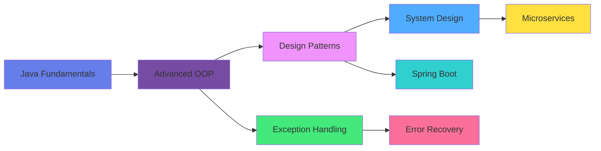

<div align="center">

# 👋 Hi, I'm Ovesh Shaikh


[](https://www.linkedin.com/in/oveshshaikh786/)
[](mailto:oveshshaikh814@gmail.com)
[](https://portfolio-ovesh.vercel.app/)


</div>


## 👨‍💻 About Me

I'm a **Full-Stack Software Developer** passionate about creating scalable, maintainable applications with clean architecture and robust error handling. I thrive on solving complex problems through elegant code solutions.

```java
public class Developer {
    private String name = "Ovesh Shaikh";
    private String[] currentFocus = {
        "Advanced Java & OOP Design Patterns",
        "Exception Handling & Error Recovery",
        "Full-Stack Development (Java + React)",
        "System Architecture & Scalability"
    };
    
    public String getApproach() {
        return "Write clean code, test thoroughly, deploy confidently";
    }
}
```

<details>
<summary><b>🎯 What I Bring to the Table (Click to expand)</b></summary>
<br>

- 💡 Strong analytical and problem-solving skills
- 🏗️ Deep understanding of OOP principles and design patterns
- 🚀 Experience building end-to-end applications from scratch
- ✨ Passionate about code quality, testing, and best practices
- 📚 Quick learner who adapts to new technologies efficiently

</details>

---

## 🛠️ Technical Arsenal

<details open>
<summary><b>Languages</b></summary>
<br>


</details>

<details open>
<summary><b>Frameworks & Libraries</b></summary>
<br>


</details>

<details open>
<summary><b>Tools & Technologies</b></summary>
<br>


</details>

<details>
<summary><b>Core Concepts & Practices</b></summary>
<br>

| Category | Skills |
|----------|--------|
| **OOP Principles** | Inheritance • Polymorphism • Encapsulation • Abstraction |
| **Design Patterns** | Factory • Singleton • Observer • MVC |
| **Software Engineering** | Exception Handling • Error Recovery • Input Validation |
| **Development** | Agile Methodology • Version Control • Code Review |

</details>

---

## 💼 Featured Projects

> Click on any project to explore the details!

<details>
<summary><b>🎫 Train Ticket Booking System</b> - Full-Stack Microservices Platform</summary>
<br>

**[View Repository →](https://github.com/oveshshaikh786/Train-ticket-booking)**

- ✅ Built comprehensive ticket booking system using **Spring Boot** backend and **React** frontend
- 🔐 Implemented **JWT authentication** for secure user sessions
- 🐳 Containerized with **Docker** for easy deployment and scalability
- 💳 Handled complex booking logic with proper transaction management

**Tech Stack:** `Java` `Spring Boot` `React` `Docker` `JWT` `MySQL`

</details>

<details>
<summary><b>🐦 Twitter Clone</b> - Real-Time Social Media Platform</summary>
<br>

**[View Repository →](https://github.com/oveshshaikh786/Twitter-Clone-Next.js-app)**

- ⚡ Developed full-featured Twitter clone with **Next.js** and modern React patterns
- 🔄 Implemented real-time updates for tweets and notifications
- 🔒 Built authentication system with secure JWT token management
- 📱 Designed responsive UI with seamless user experience

**Tech Stack:** `Next.js` `React` `JavaScript` `JWT` `Real-time APIs`

</details>

<details>
<summary><b>🎓 University Course Management System</b> - Advanced OOP Application</summary>
<br>

**[View Repository →](https://github.com/oveshshaikh786/university-course-management-java)**

- 🏗️ Architected robust course management system showcasing **inheritance** and **abstraction**
- 📚 Implemented support for both classroom and online learning models
- 🔧 Designed extensible class hierarchy for easy feature additions
- 🎯 Applied interface-based design for flexible component integration

**Tech Stack:** `Java` `OOP Design Patterns` `Inheritance` `Interfaces`

</details>

<details>
<summary><b>🦁 Zoo Management System</b> - Interactive CLI Application</summary>
<br>

**[View Repository →](https://github.com/oveshshaikh786/zoo-management-system-java)**

- 🎮 Created menu-driven simulation applying core **OOP principles**
- 🔄 Demonstrated polymorphism through animal behavior modeling
- 🔐 Implemented proper encapsulation and data hiding
- 💻 Built intuitive command-line interface for user interactions

**Tech Stack:** `Java` `OOP` `CLI Development` `Design Patterns`

</details>

<details>
<summary><b>☕ Java Brew System</b> - Advanced Exception Handling Demo</summary>
<br>

**[View Repository →](https://github.com/oveshshaikh786/java-brew-system)**

- ☕ Developed comprehensive coffee ordering system with **custom exception handling**
- 🔗 Implemented inheritance hierarchy (Coffee → Espresso/Latte)
- ✅ Built robust input validation and error recovery mechanisms
- 📋 Demonstrated checked vs unchecked exception handling patterns

**Tech Stack:** `Java` `Exception Handling` `Inheritance` `CLI`

</details>

<details>
<summary><b>📊 Contoso Data Analysis</b> - Data Warehouse & BI Platform</summary>
<br>

**[View Repository →](https://github.com/oveshshaikh786/contoso-data-analysis-dw)**

- 📈 Built data warehouse for retail analytics using **OLAP** and **MDX**
- 🎯 Implemented dimensional modeling for efficient data analysis
- 📊 Created complex queries for business insights and reporting
- ⭐ Designed star schema for optimal query performance

**Tech Stack:** `SQL` `OLAP` `MDX` `Data Warehousing` `BI`

</details>

---

## 📊 GitHub Analytics

<div align="center">
  


</div>

---

## 🏆 GitHub Achievements

<div align="center">

[](https://github.com/ryo-ma/github-profile-trophy)

</div>

---

## 🎯 Current Learning Journey



<details>
<summary><b>📚 Currently Exploring</b></summary>
<br>

- ☕ Advanced Java concepts (Streams, Lambdas, Concurrency)
- 🏗️ System design and architectural patterns
- 🔐 Security best practices (OAuth2, JWT)
- 🐳 DevOps fundamentals (Docker, CI/CD)
- 📊 Data structures and algorithms for interviews

</details>

---

## 💡 Current Focus

<table>
  <tr>
    <td>🔨</td>
    <td>Building microservices-based applications with Spring Boot</td>
  </tr>
  <tr>
    <td>📚</td>
    <td>Deepening knowledge of distributed systems and scalability</td>
  </tr>
  <tr>
    <td>🧪</td>
    <td>Contributing to open-source projects</td>
  </tr>
  <tr>
    <td>📝</td>
    <td>Writing technical blog posts about Java and software engineering</td>
  </tr>
  <tr>
    <td>🎓</td>
    <td>Preparing for technical interviews and certifications</td>
  </tr>
</table>

---

## 🤝 Open to Collaboration

<div align="center">

| **Open Source Projects** | **Hackathons** | **Mentorship** | **Complex Problems** |
|:------------------------:|:--------------:|:--------------:|:--------------------:|
| Contributing to meaningful projects | Building innovative solutions | Pair programming & code reviews | Creative technical challenges |

</div>

---

## 📬 Let's Connect!

<div align="center">

[](https://www.linkedin.com/in/oveshshaikh786/)
[](mailto:oveshshaikh814@gmail.com)
[](https://portfolio-ovesh.vercel.app/)

**💼 Open to:** Full-time opportunities • Freelance projects • Technical collaborations

</div>

---

<div align="center">

### 💭 Random Dev Quote


### 📈 Contribution Snake


---


**⭐ From [oveshshaikh786](https://github.com/oveshshaikh786)**

*Thanks for visiting! If you find my work interesting, feel free to ⭐ star the repos!*


</div>
