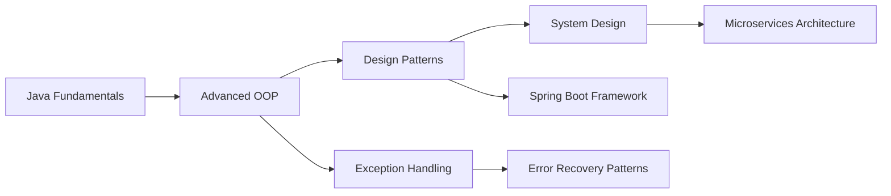

<div align="center">

# Ovesh Shaikh

### Full-Stack Developer | Java Specialist | Problem Solver

[](https://www.linkedin.com/in/oveshshaikh786/)
[](mailto:oveshshaikh814@gmail.com)
[](https://portfolio-ovesh.vercel.app/)


</div>

---

## 👨‍💻 About Me

I'm a **Full-Stack Software Developer** with a strong foundation in **Java**, **Python**, **JavaScript** and **Modern Web technologies.** I build scalable, maintainable applications with a focus on clean architecture and robust error handling. My passion lies in solving complex problems through code and continuously expanding my technical expertise.
```java
public class Developer {
    private String name = "Ovesh Shaikh";
    private String[] currentFocus = {
        "Advanced Java & OOP Design Patterns",
        "Exception Handling & Error Recovery",
        "Full-Stack Development (Java + React)",
        "System Architecture & Scalability"
    };
    
    public String getApproach() {
        return "Write clean code, test thoroughly, deploy confidently";
    }
}
```

**🎯 What I Bring to the Table:**
- Strong analytical and problem-solving skills
- Deep understanding of OOP principles and design patterns
- Experience building end-to-end applications from scratch
- Passionate about code quality, testing, and best practices
- Quick learner who adapts to new technologies efficiently

---

## 🛠️ Technical Skills

### Languages


### Frameworks & Libraries


### Tools & Technologies


### Concepts & Practices
- **OOP Principles:** Inheritance, Polymorphism, Encapsulation, Abstraction
- **Design Patterns:** Factory, Singleton, Observer, MVC
- **Software Engineering:** Exception Handling, Error Recovery, Input Validation
- **Development:** Agile Methodology, Version Control, Code Review

---

## 💼 Featured Projects

### 🎫 [Train Ticket Booking System](https://github.com/oveshshaikh786/Train-ticket-booking)
**Full-Stack Ticket Booking Platform with Microservices Architecture**
- Built a comprehensive ticket booking system using **Spring Boot** backend and **React** frontend
- Implemented **JWT authentication** for secure user sessions
- Containerized with **Docker** for easy deployment and scalability
- Handled complex booking logic with proper transaction management

**Tech:** Java, Spring Boot, React, Docker, JWT, MySQL

---

### 🐦 [Twitter Clone](https://github.com/oveshshaikh786/Twitter-Clone-Next.js-app)
**Real-Time Social Media Platform**
- Developed a full-featured Twitter clone with **Next.js** and modern React patterns
- Implemented real-time updates for tweets and notifications
- Built authentication system with secure JWT token management
- Designed responsive UI with seamless user experience

**Tech:** Next.js, React, JavaScript, JWT, Real-time APIs

---

### 🎓 [University Course Management System](https://github.com/oveshshaikh786/university-course-management-java)
**Educational Platform Demonstrating Advanced OOP**
- Architected a robust course management system showcasing **inheritance** and **abstraction**
- Implemented support for both classroom and online learning models
- Designed extensible class hierarchy for easy feature additions
- Applied interface-based design for flexible component integration

**Tech:** Java, OOP Design Patterns, Inheritance, Interfaces

---

### 🦁 [Zoo Management System](https://github.com/oveshshaikh786/zoo-management-system-java)
**Interactive CLI Application with OOP Concepts**
- Created a menu-driven simulation applying core **OOP principles**
- Demonstrated polymorphism through animal behavior modeling
- Implemented proper encapsulation and data hiding
- Built intuitive command-line interface for user interactions

**Tech:** Java, OOP, CLI Development, Design Patterns

---

### ☕ [Java Brew System](https://github.com/oveshshaikh786/java-brew-system)
**Coffee Shop Management CLI with Advanced Exception Handling**
- Developed a comprehensive coffee ordering system with **custom exception handling**
- Implemented inheritance hierarchy (Coffee → Espresso/Latte)
- Built robust input validation and error recovery mechanisms
- Demonstrated checked vs unchecked exception handling patterns

**Tech:** Java, Exception Handling, Inheritance, CLI

---

### 📊 [Contoso Data Analysis - Data Warehouse](https://github.com/oveshshaikh786/contoso-data-analysis-dw)
**Business Intelligence & Analytics Platform**
- Built a data warehouse for retail analytics using **OLAP** and **MDX**
- Implemented dimensional modeling for efficient data analysis
- Created complex queries for business insights and reporting
- Designed star schema for optimal query performance

**Tech:** SQL, OLAP, MDX, Data Warehousing, BI

---

## 📊 GitHub Statistics

<div align="center">


</div>

<div align="center">


</div>

<div align="center">


</div>

---

## 🏆 GitHub Trophies

<div align="center">


</div>

---

## 📈 Contribution Graph

<div align="center">


</div>

---

## 🎯 Current Learning Path


**Currently exploring:**
- ☕ Advanced Java concepts (Streams, Lambdas, Concurrency)
- 🏗️ System design and architectural patterns
- 🔐 Security best practices (OAuth2, JWT)
- 🐳 DevOps fundamentals (Docker, CI/CD)
- 📊 Data structures and algorithms for interviews

---

## 💡 What I'm Working On

- 🔨 Building microservices-based applications with Spring Boot
- 📚 Deepening knowledge of distributed systems and scalability
- 🧪 Contributing to open-source projects
- 📝 Writing technical blog posts about Java and software engineering
- 🎓 Preparing for technical interviews and certifications

---

## 🤝 Let's Collaborate

I'm always interested in:
- **Open Source Projects** - Contributing to meaningful projects
- **Hackathons** - Building innovative solutions under pressure
- **Learning Opportunities** - Mentorship, pair programming, code reviews
- **Interesting Problems** - Complex challenges that require creative solutions

---

## 📬 Get In Touch

<div align="center">

[](https://www.linkedin.com/in/oveshshaikh786/)
[](mailto:oveshshaikh814@gmail.com)
[](https://portfolio-ovesh.vercel.app/)

**💼 Open to:** Full-time opportunities | Freelance projects | Technical collaborations

</div>

---

<div align="center">

### 💭 Developer Quote


---

**⭐ From [oveshshaikh786](https://github.com/oveshshaikh786)**

*Thanks for visiting! If you find my work interesting, feel free to ⭐ star the repos!*

</div>
